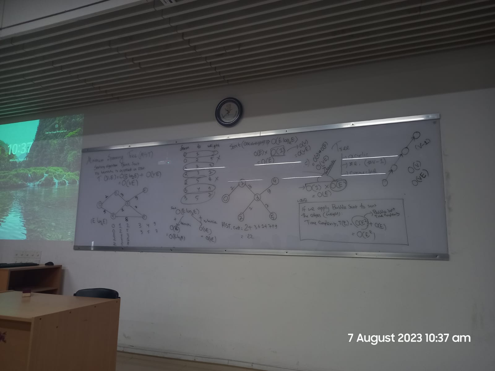

#### comment :
<!--markdown -->
Riasad Alvi  
Second Line
---
# Heading 1  
## Heading 2  
### Heading 3  
#### Heading 4   

<p> This is a simple paragraph . Nothing else . I am writing this example to see if the paragraph tag of HTML works fine</p>    

</br>
 
 ### Italic Text example : 
  
_this is an italic font example_  
<br/>

### Bold Text example : 
__this is bold font example__  


<br/>

### Strikethrouch Example : 
~~this is a strike through example~~  

### Single line code example :  
  
`this is an inline example of a cpp prog to print " Hello "`


### Multiple line code example :  

```cpp

#include<iostream>  
using namespace std;
int main()
{
    cout<<"Hello";
}


```

### list example :   
 1. list 1  :
     1. list 1.1
     2. list 1.2
 2. list 2
 3. list 3


### Unordered list example : 
- list 1  
    - list 1.1
    - list 1.2
   
- list 2
- list 3


### To-do list example : 
- [x] task 1
- [x] task 2
- [ ] task 3 


### Automatic Link : 
https://www.msi.com/index.php

### Disabed Link : 
`https://www.msi.com/index.php`

### Markdown format link :
[MSI](https://www.msi.com/index.php)   

### Image Syntax : 
    


### html image syntax :


### emoji : 

❤️ 🔥


### Table :


| First Header  | Second Header |
| ------------- | ------------- |
| Content Cell  | Content Cell  |
| Content Cell  | Content Cell  |

